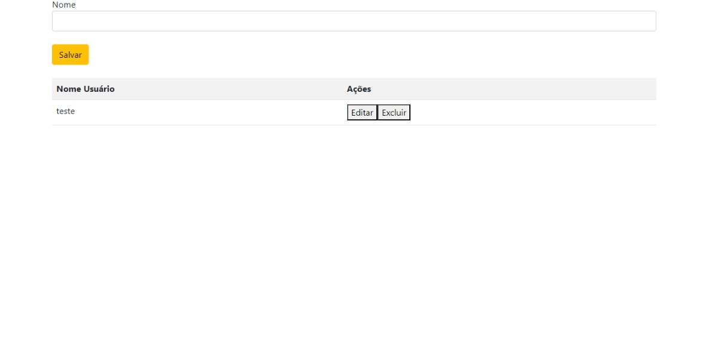
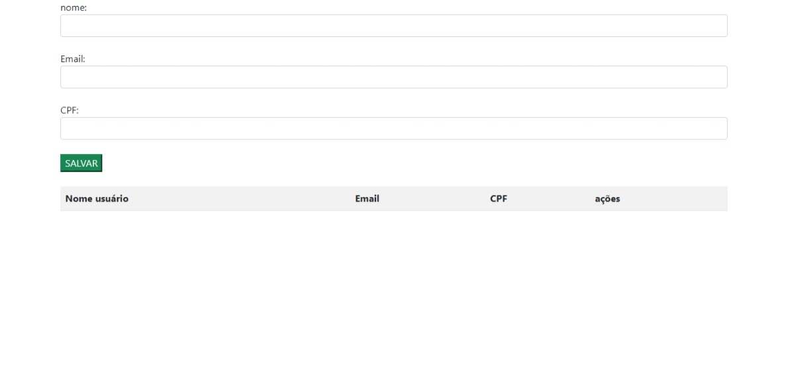

# Trabalho de login e cadastro

# Sistema de Login e Cadastro de Usuários
Este projeto é um sistema básico para login e cadastro de usuários. Ele permite que os usuários se registrem, visualizem uma lista de usuários cadastrados e editem ou excluam registros. Este README fornece uma visão geral do funcionamento do sistema e como utilizá-lo.

# Funcionalidades
Tela de Login:

Valida se os campos de e-mail e senha estão preenchidos.
Redireciona para a página de cadastro se os campos estiverem completos.
Cadastro de Usuários:

Permite a inserção de um novo usuário com nome, e-mail e CPF.
Valida o formato do e-mail antes de adicionar à lista.
Atualiza a lista de usuários exibida na tela após a adição.
Gerenciamento da Lista de Usuários:

Exibe uma tabela com a lista de usuários cadastrados.
Permite editar e excluir registros na tabela
# Instruções de Uso
Login:

Acesse a tela de login e insira seu e-mail e senha.
Clique em "Entrar" para ser redirecionado para a página de cadastro.
# Cadastro:

Preencha os campos de nome, e-mail e CPF.
Clique em "Salvar" para adicionar o usuário à lista.
# Gerenciamento da Lista:

Edite ou exclua usuários clicando nos botões correspondentes na tabela.
Notas
O sistema não inclui uma funcionalidade de armazenamento persistente. Os dados são armazenados apenas na memória do navegador e serão perdidos ao atualizar a página ou fechar o navegador.
A validação do e-mail é feita de forma básica, verificando a presença de "@" e ".."
 
# Validação de CPF:

Verifica se um número de CPF é válido.
Remove caracteres não numéricos e valida a estrutura do CPF, incluindo a verificação dos dígitos verificadores.
# Armazenamento de Nomes:

Armazena nomes de usuários em um array para posterior uso e manipulação.
# Estrutura do Código: 
Função validarCPF(cpf)
Valida um número de CPF conforme a legislação brasileira. A função realiza as seguintes operações:

Remove caracteres não numéricos.
Verifica se o CPF possui 11 dígitos e se não é composto por todos os dígitos iguais.
Calcula e valida os dois dígitos verificadores do CPF.
Retorna true se o CPF for válido e false caso contrário.

# pessoas que ajudou no trabalho 
<https://github.com/mariayanagui> 
<https://github.com/LeonardoRochaMarista>  

